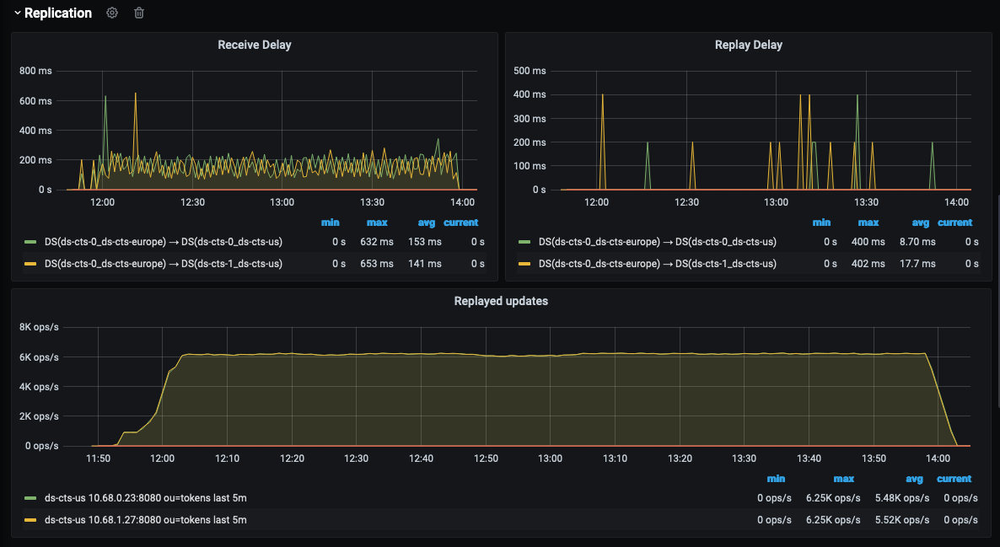

= Deploy DS on Kubernetes multi-cluster (GKE)

:description: Deploy DS on Kubernetes multi-cluster (GKE). Step-by-step solution to make fully meshed replication, +
needed for HA of DS, work on GKE multi-cluster level.
:library: Asciidoctor
ifdef::asciidoctor[]
:source-highlighter: coderay
endif::asciidoctor[]
:idprefix:
:stylesheet: asciidoc.css
//:backend: docbook45
//:backend: html5
//:doctype: book
//:sectids!:
//:plus: &#43;

These instructions show how to deploy a multi-cluster DS solution that spans two GKE clusters from different
regions.

This configuration allows pods in one GKE cluster to discover pods in another GKE cluster without exposing any of the DNS information to the world outside your GKE project.

NOTE: We will use the standard stateful applications (DS-CTS & DS-IDREPO) to deploy in each of the 2 GKE clusters and
scale them out and back using native Cloud Console Kubernetes scaling approach.


[[introduction,Introduction]]
== Introduction

For DS replication to work properly, the following are required:

. [[introduction-topology, Introduction point 1]]All servers in the topology must be able to connect to each
other; their network must be routed.
. [[introduction-FQDN, Introduction point 2]]FQDNs must be unique and resolvable by all servers.
. [[introduction-server-id, Introduction point 3: unique server ID in topology]]The server ID assigned to each server
in the topology must be
unique.
. [[introduction-bootstrap, Introduction point 4: bootstrap RS servers]]The DS replication bootstrap server settings
must include at least one server from each cluster in the topology.
. [[introduction-certificates, Introduction point 5]]The certificates used to establish server identities must be
verifiable,
by using
the
same CA or by properly
configuring the keystores.

The method described in this document explains how to put configure a topology that meets these requirements.

[[prerequisites,Prerequisites]]
== Prerequisites

* [[prerequisites-same-VPC, Prerequisites point 1]]2 GKE clusters running version 1.18.12+ in the same VPC network

NOTE: this was the version used; the configuration might work on 1.17 or earlier)

* [[prerequisites-same-namespace, Prerequisites point 2]]Same namespace name on both GKE clusters.

NOTE: This restriction is imposed by the +secret-agent+ solution used to retrieve DS certificates.
For an alternative DS certificates storage/reconciliation solution, this restriction may not apply.

* [[prerequisites-nodes, Prerequisites point 3]]2+ nodes in each GKE cluster for tests to scale out/scale back

NOTE: tested configuration: the node pool with 2 machines of +e2-standard-8+ type (8 vCPU, 32 GB memory)

* Skaffold v1.19.0+

[[setup-DNS,Setup global DNS]]
== 1. Setup global DNS
This step sets up a global DNS system across 2 GKE clusters in the same VPC so that the pods in one cluster can
connect to the pods in another cluster.

TIP: In addition, clients in a VPC network connected to the LoadBalancer network using VPC Network Peering can also
access the pods.

[[create-ILB,Create internal load balancers in clusters]]
=== a. Create internal load balancers in clusters

Having internal load balancers with configured global access installed on each cluster will allow Kubernetes DNS to balance the requests
from each client in the same VPC network to the pods on each cluster involved in multi-cluster installation.

NOTE: Using external load balancers for this purpose is possible but is not recommended from a security best
practices standpoint.
This is because it would make the DNS information for all the clusters available on the public Internet.

The YAML file below declares an internal load balancer with configured global access.

****
dns-lb.yaml https://github.com/ForgeRock/forgeops/tree/master/etc/multi-cluster/kubedns/files/dns-lb.yaml[(latest version)]
```yaml
apiVersion: v1
kind: Service
metadata:
  annotations:
    networking.gke.io/load-balancer-type: "Internal"
    networking.gke.io/internal-load-balancer-allow-global-access: "true"
  labels:
    k8s-app: kube-dns
  name: kube-dns-lb
  namespace: kube-system
spec:
  ports:
  - name: dns
    port: 53
    protocol: UDP
    targetPort: 53
  selector:
    k8s-app: kube-dns
  sessionAffinity: None
  type: LoadBalancer
```
****

=== b. Configure DNS map

This step configures DNS maps for each cluster. This causes the DNS from one cluster to direct
requests with a particular DNS suffix to an appropriate load balancer in another cluster.

Below is an example of a Kubernetes DNS ConfigMap declaration for the Europe cluster.

```yaml
apiVersion: v1
kind: ConfigMap
metadata:
  name: kube-dns
  namespace: kube-system
data:
  stubDomains: |
    {"ds-cts-us.multi-cluster.svc.cluster.local": ["10.168.0.7"]}
```

As you can see, the ConfigMap contains a +stubDomains+ parameter; a JSON map where:

* key is a DNS suffix (+"ds-cts-us.multi-cluster.svc.cluster.local"+)
* value is a JSON array of IPs (+["10.168.0.7"]+): the load balancer IP in the US cluster.

This configuration instructs *DNS in Europe cluster* to forward the requests with specified DNS suffix to *load
balancer in US cluster*.

image::K8S DNS.png[]

The script https://github.com/ForgeRock/forgeops/tree/master/etc/multi-cluster/kubedns/files/multi-cluster-setup.py[+multi-cluster-setup.py+]
will help you automate the following steps:

. Create the internal load balancers in each Kubernetes cluster (using configuration from xref:create-ILB[])
. Generate a DNS ConfigMap declaration for each cluster based on the current declaration for each cluster
. Apply the newly generated DNS ConfigMap
. Restart the clusters' DNS by deleting the +kube-dns+ pods

[[configure-sa,Configure secret agent parameters]]
== 2. Configure secret agent parameters

If your DS installation is not using the +secret-agent+ operator as a manager of certificates for server identity
verification  as mentioned in xref:introduction-certificates[], you can skip this step.

The +multi-cluster-secrets/kustomization.yaml+ below was changed:

. +secretsManagerPrefix+ is changed to ensure uniqueness of stored secrets
. +secretsManager+ is changed to +GCP+ as a chosen Cloud Provider
. +gcpProjectID+ is changed in order to be able to use Secret Manager API

****
multi-cluster-secrets/kustomization.yaml https://github.com/ForgeRock/forgeops/tree/master/kustomize/overlay/multi-cluster/multi-cluster-secrets/kustomization.yaml[(latest version)]
```yaml
resources:
  - ../../../base/secrets

patchesStrategicMerge:
  - |-
    #Patch the SAC
    apiVersion: secret-agent.secrets.forgerock.io/v1alpha1
    kind: SecretAgentConfiguration
    metadata:
      name: forgerock-sac
    spec:
      appConfig:
        secretsManagerPrefix: "multi-cluster"
        secretsManager: GCP # none, AWS, Azure, or GCP
        gcpProjectID: engineering-devops
```
****

[[Setup-DS,Setup DS]]
== 3. Setup DS

This step sets up the DS solution.

Both DS-CTS and DS-IDREPO will be deployed on 2 clusters to simulate the ForgeRock stack.

This uses a ForgeOps configuration based on:

* Kustomize - a standalone tool to customize Kubernetes objects through a kustomization file

* Skaffold - a command line tool that facilitates continuous development for Kubernetes applications, handles the
workflow for building, pushing and deploying your application.

The examples show how to configure DS to be deployed on the US cluster. Apply a similar configuration for
the other cluster.


[[prepare-kustomize,Prepare Kustomize definitions]]
=== a. Prepare Kustomize definitions

To make FQDNs of each DS pod in our topology unique, as required by xref:introduction-FQDN[], the FQDN of each pod
has a cluster-specific subdomain, which in this case is implemented by changing the service name
(Ex. +*ds-cts-us*+ in +ds-cts-0.*ds-cts-us*.multi-cluster.svc.cluster.local+).

NOTE: FQDN uniqueness can be also guaranteed by a cluster-specific namespace +
(Ex. +*multi-cluster-us*+ in +ds-cts-0.ds-cts.*multi-cluster-us*.svc.cluster.local+), but due to
restrictions from xref:prerequisites-same-namespace[], this approach was not retained.

As the extract from +multi-cluster-ds-us/kustomization.yaml+ shows, the following were changed:

. +Service metadata/name+ is unique among clusters (*ds-cts-us*)
. +StatefulSet spec/template/spec/subdomain+ is added and is the same as +service metadata/name+ mentioned above (*ds-cts-us*)
. +StatefulSet spec/template/spec/containers/env+ is added to fulfill the needs of xref:introduction-bootstrap[].
(*- name: DS_BOOTSTRAP_REPLICATION_SERVERS...*)

****
kubedns-us/kustomization.yaml https://github.com/ForgeRock/forgeops/tree/master/kustomize/overlay/multi-cluster/kubedns-us/kustomization.yaml[(latest version)]
....
patches:
- target:
    kind: Service
    name: ds-cts
  patch: |-
    - op: replace
      path: /metadata/name
      value: ds-cts-us

----------------------------------------------------

patchesStrategicMerge:
  - |-
    #Patch DS CTS
    apiVersion: apps/v1
    kind: StatefulSet
    metadata:
      name: ds-cts
    spec:
      template:
        spec:
          subdomain: ds-cts-us
          containers:
            - name: ds
              env:
                - name: DS_BOOTSTRAP_REPLICATION_SERVERS
                  value: ds-cts-0.ds-cts-us.multi-cluster.svc.cluster.local:8989,ds-cts-0.ds-cts-europe.multi-cluster.svc.cluster.local:8989
....
****

[[prepare-skaffold,Prepare Skaffold profiles]]
=== b. Prepare Skaffold profiles

Here is an extract from +skaffold.yaml+ file with a profile for multi-cluster definition for the US cluster.
This uses ForgeOps dockerized artifacts, described in xref:docker-config-DS[], and the US kustomization from
xref:prepare-kustomize[].

****
skaffold.yaml https://github.com/ForgeRock/forgeops/blob/master/skaffold.yaml[(latest version)]
....
artifactDefinitions:
    - &DS-CTS_BASE
      image: ds-cts
      context: docker/7.0/ds
    - &DS-CTS
      <<: *DS-CTS_BASE
      docker:
        dockerfile: cts/Dockerfile
    - &DS-IDREPO_BASE
      image: ds-idrepo
      context: docker/7.0/ds/
    - &DS-IDREPO
      <<: *DS-IDREPO_BASE
      docker:
        dockerfile: idrepo/Dockerfile

------------------------------------------------------------------

profiles:
- name: multi-cluster-ds-us
  build:
    artifacts:
      - *DS-CTS
      - *DS-IDREPO
    tagPolicy:
      sha256: {}
  deploy:
    kustomize:
      path: ./kustomize/overlay/multi-cluster/kubedns-us
....
****

[[deploy-DS,Skaffold profiles]]
=== c. Deploy Skaffold profiles

Once the configuration for all clusters is in place, you can start the topology.
Below is an example of the Skaffold command to run the pre-configured profile.

....
skaffold run --profile multi-cluster-ds-us
....

The command must be executed for each cluster in the topology with the appropriate namespace.

For example:

```bash
#! /bin/bash

# multi-cluster DS: script to deploy DS CTS and DS IDREPO to US and Europe clusters
# Usage: ./etc/multi-cluster/kubedns/deploy-ds.sh us-gke-context europe-gke-context namespace

NAMESPACE=${1:-multi-cluster}
US_CONTEXT=${2:-cloud_us-west2_ds-topology}
EUROPE_CONTEXT=${3:-cloud_europe-west2_ds-topology}

echo "multi-cluster DS deployment to GKE"
echo "Using the following values:"
echo " - US GKE context: $US_CONTEXT"
echo " - Europe GKE context: $EUROPE_CONTEXT"
echo " - Namespace: $NAMESPACE"

echo
echo "-----"
echo "Deploying DS to US cluster"
kubectx $US_CONTEXT
kubens multi-cluster
skaffold run --profile multi-cluster-ds-us

echo
echo "-----"
echo "Deploying DS to EUROPE cluster"
kubectx $EUROPE_CONTEXT
kubens multi-cluster
skaffold run --profile multi-cluster-ds-eu
```

== 4. Load tests

=== a. Addrate load test

We run some basic load on a deployment consisting of three replicated servers, one in Europe and two in the US clusters, just to make sure the setup did not have any major problems, independently of absolute numbers.
The `addrate` load was tested on the server in Europe (`ds-cts-0_ds-cts-europe`)
on CTS-like entries for an overnight run (14 hours).
A screenshot from Grafana shows the behaviour of the two servers in the US (`ds-cts-0.ds-cts-us` and `ds-cts-1.ds-cts-us`):

image::addrate_perf_grafana.png[]

The replication load was constant throughout the test, and its duration is 14 hours, the same as the load.
This means both US servers were closely following the client load.
The low replication delay confirms both were following the client load.
There are some outliers but replication recovers easily.

=== b. Modrate load test

The `modrate` load test uses the same setup as for the `addrate`, but with more CPU resources to be able to apply more load.
The run was shortened to 2 hours.



Again, the replication load is stable throughout and follows the client load. The increased load makes the replication delay a bit higher, but stable and acceptable.

== 5. Billing

Billing for the tests above seems to be the column dated March 3rd, from what we understand.

image::billing.png[]

== 6. Pros and Cons

|===
|Pros |Cons

|1. Native Kubernetes solution: only modifies K8S objects
|1. Few parameters to customize in _Dockerfile_, _docker-entrypoint.sh_, _kustomization.yaml_, _skaffold.yaml_

|2. Simple installation: 1 internal load balancer required per regional cluster
|2. Administrative action required to configure the DNS server on clusters (must run a script)

|3. Scale out/scale back using Kubernetes: no additional administration
|3. DNS service restart needed to take into account the net configuration map

|4. Explicit naming allows quick identification of servers (Ex: `ds-cts-0.ds-cts-us.namespace.cluster.local`)
|

|5. Installation scripts ready: see 'multi-cluster' in the `forgeops` project
|

|6. So far, tests are reassuring: replication latency is acceptable
|
|===
