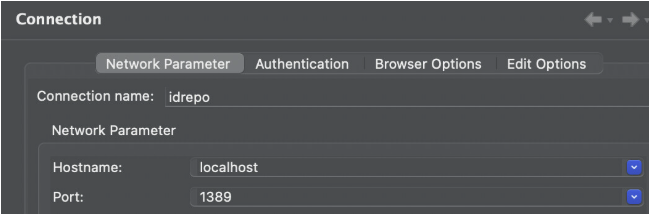
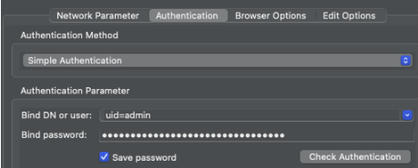

# Overview
This document provides sets of instructions explaining how to customize and manage your PingDS deployment when deployed into a Kubernetes environment using ForgeOps. The use cases below are some of the more common use cases required by a majority of users and should help bridge the gap between tasks that users often know how to execute in an on-prem PingDS deployment but don’t know how to achieve the same outcome with a ForgeOps deployment.

>**NOTE:** Replace your my-env in this doc with your ForgeOps env throughout this doc.

## ADDING CUSTOM LDAP CONFIGURATION
Custom LDAP configuration can be included in your PingDS image by adding your custom ldif files to the docker/ds/ldif-ext directory. This directory has been separated into subdirectories for each backend so just drop your ldif files into the relevant subdirectory and rebuild the PingDS image:

1. Build your PingDS image e.g.
    ```sh
    forgeops build ds --tag TAG_NAME --env-name my-env
    ```

2. Deploy PingDS:  
    **Helm:**
    ```yaml
    helm upgrade -i identity-platform identity-platform --repo https://ForgeRock.github.io/forgeops --version VERSION -f helm/my-env/values.yaml
    ``` 
    **Kustomize: (Deprecated) **
    ```sh
    forgeops apply --env-name my-env ds
    ```

Validate your changes by attaching an ldap directory viewer to view the LDAP changes.

>**IMPORTANT:** These changes can only be made to a fresh deployment of PingDS.
If you want update the image on an already running deployment, ensure you delete the PVC prior to redeploying PingDS.
If you want to update PingDS without downtime, then follow the steps in the [**Online LDAP updates**](online-ldap-updates) section below

### Online LDAP updates
To update the LDAP confguration entries online without restarting PingDS, use the ldapmodify command but also make sure that your maintain the same custom LDAP configuration changes in your forgeops repo for future deployments.  See PingDS documentation for more information.  

## ADDING CUSTOM LDAP SCHEMA
LDAP schema is configured in the upstream PingDS image and not in forgeops. But you can include custom schema changes by following the below steps:

1. Add all custom schema files to `docker/ds/config/schema`.  There is a sample file in this location to use as a starting point.

2. Build your PingDS image
    ```sh
    forgeops build ds --tag TAG_NAME --env-name my-env
    ```

3. Deploy PingDS:  
    **Helm:**
    ```yaml
    helm upgrade -i identity-platform identity-platform --repo https://ForgeRock.github.io/forgeops --version VERSION -f helm/my-env/values.yaml
    ``` 
    **Kustomize: (Deprecated)**
    ```sh
    forgeops apply --env-name my-env ds
    ```

4. Validate your changes by attaching an ldap directory viewer to view the schema.  See [Attach Apache Directory Studio](#viewing-the-ldap-directory-using-apache-directory-studio)

>**IMPORTANT:** These changes can only be made to a fresh deployment of PingDS.
If you want update the image on an already running deployment, ensure you delete the PVCs prior to redeploying PingDS.
If you want to update PingDS without downtime, then see the “Online schema changes” section below.

### Online schema changes
To update the schema on a running server, follow the commands in the DS documentation but also make sure that your maintain the same custom schema changes in your forgeops repo for future deployments.

## UPDATING RUNTIME(LIFECYCLE) SCRIPTS TO CUSTOMIZE IDREPO AND CTS SEPARATELY
By default, ForgeOps offers a single PingDS docker image that is consumed by both idrepo and cts pods. The scripts in the `docker/ds` directory are common to both idrepo and cts including the skeleton ds setup configured in `docker/ds/ds-setup.sh`.  To configure individual server profiles for ds-idrepo and ds-cts, use the runtime scripts provided in the `docker/ds/runtime-scripts` directory.  The scripts are used as follows:  
- setup: Initial setup which runs on first deployment when the PVC contains no data.
- post-init: Additional setup which runs on subsequent deployments when the PVC already contains data.

## VIEWING THE LDAP DIRECTORY USING APACHE DIRECTORY STUDIO
1. Download and open Apache Directory Studio

2. Retrieve your PingDS admin password from the ds-passwords Kubernetes secret:
    ```sh
    kubectl get secret ds-passwords -o jsonpath='{.data.dirmanager\.pw}' | base64 -d
    ```

3. Port forward to your PingDS server on your terminal
    ```sh
    kubectl port-forward ds-idrepo-0 1389
    ```

4. Configure Apache Directory Studio to connect to your DS server:

    a. Create a new LDAP connection.  
    b. Complete the Network Parameter tab as follows:
    

    c. Update the Authentication tab with the Bind DN and the password you retrieved in step 2 and click on `Check Authentication` to verify that the connection is successful:
    

5. Click on your new LDAP connection to bring up the LDAP browser or right click to view option to open schema browser.